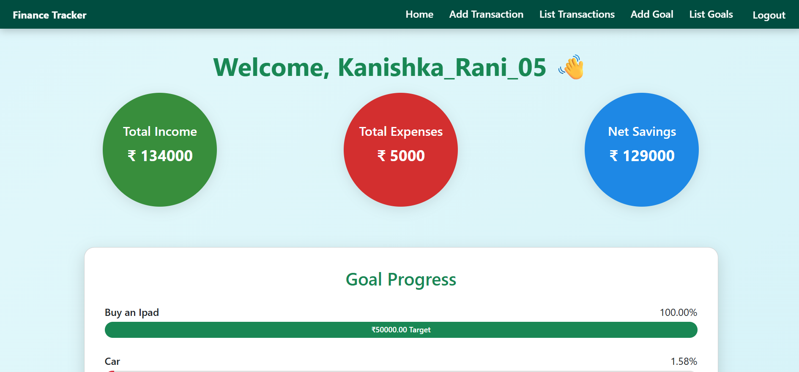
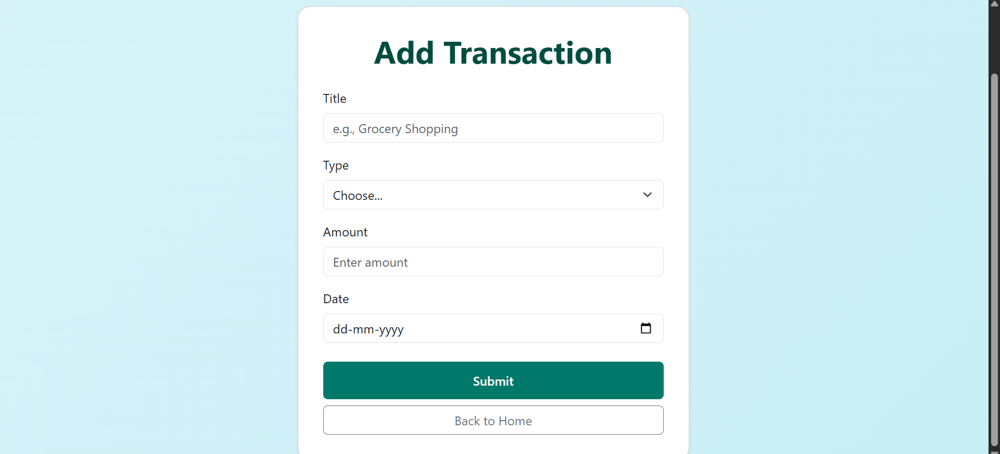
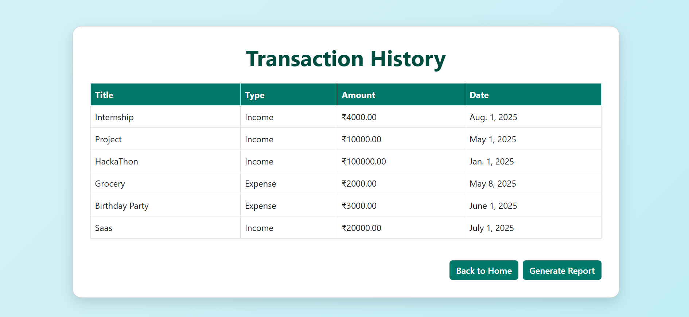
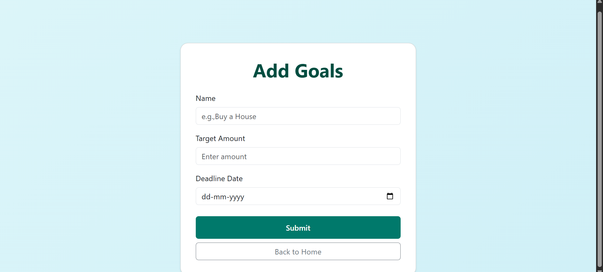
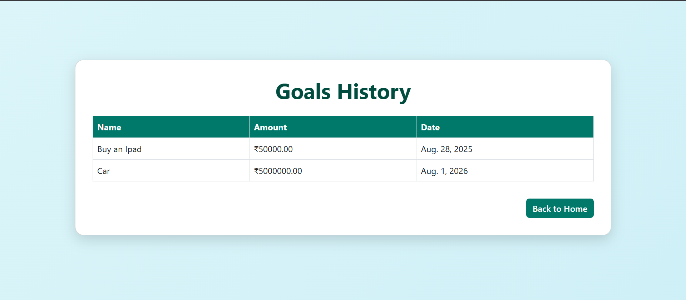
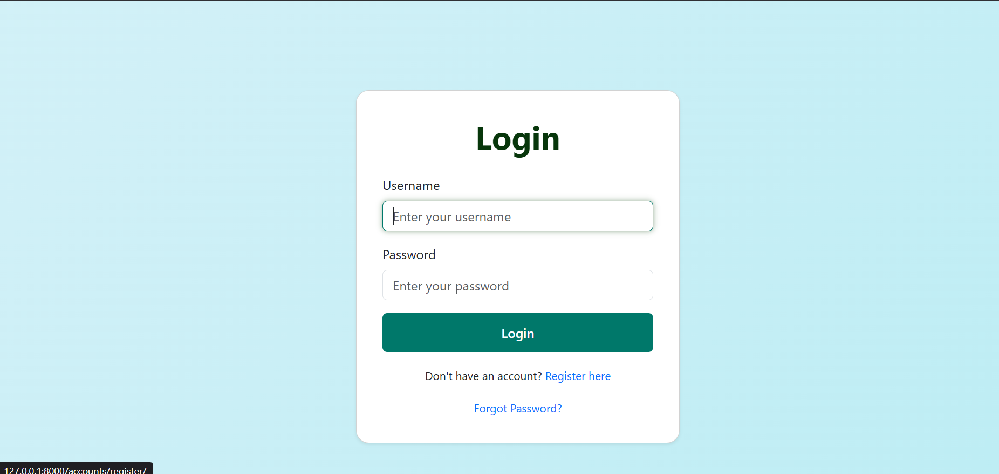
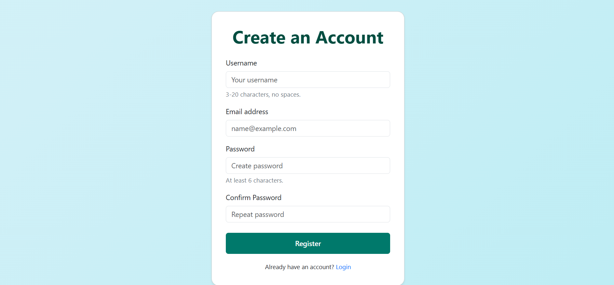

# FINANCE TRACKER 

A personal finance tracking web application built with Django.  
Track your income, expenses, set financial goals, and visualize your progress with clean dashboards and reports.


---

## 🔧 Features

- 🔐 User authentication (register/login/logout)
- 📥 Add, edit, and view transactions (income & expenses)
- 🎯 Set savings goals with progress tracking
- 📊 Dashboard summary of total income, expenses & net savings
- 📈 Goal progress with dynamic progress bars
- 🧾 Generate transaction reports
- 🟢 Styled with Bootstrap and custom green-themed UI

---

## 📂 Project Structure

FinanceTracker/

├── finance/ # Main app (views, models, templates)

├── templates/ # HTML templates

├── db.sqlite3 # Default DB (SQLite)

├── manage.py

└── requirements.txt # Python dependencies


---

## 🚀 Getting Started

### 1. Clone the repo

```bash
git clone https://github.com/kanishka-rani-2005/FinanceTracker.git
cd FinanceTracker

```
---

### 2. Set up a virtual environments

```bash
python -m venv venv
source venv/bin/activate   # On Windows: venv\Scripts\activate

```


### 3. Install dependencies

```bash
pip install -r requirements.txt
```


### 4. Apply migrations and run server
```bash
python manage.py makemigrations
python manage.py migrate
python manage.py runserver


```


##Visit http://127.0.0.1:8000/ in your browser to start using the app.


## 📸 Demo Screenshots

### 🏠 Dashboard View


### ➕ Add Transaction


### 📋 Transaction List


### 🎯 Add Goal


### 📈 Goal Progress View


### 📑 Register Page


### 🔐 Login Page



## 📌 Tech Stack

Framework: Django

Language: Python

Frontend: Bootstrap 5, HTML, CSS

Database: SQLite (default), easily switchable to PostgreSQL or MySQL

Auth: Django built-in authentication

Hosting: Not yet deployed (Can be hosted on Heroku, Railway, Render, etc.)

## 👩‍💻 Author

KANISHKA RANI
Email : kanishka22043@gmail.com


## ⭐ Star the repo
If you like the project, please consider starring it to support and spread the word!